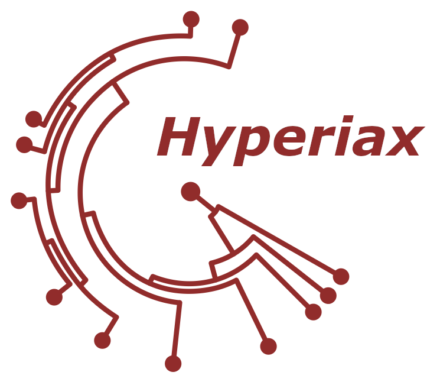

# Hyperiax: Tree traversals using JAX
<p align="center">
 
</p>

## Introduction

_Hyperiax_ is a framework for tree traversal and computations on large-scale tree. Its primary purpose is to facilitate **efficient message passing** and **operation execution** on large trees. Hyperiax uses [JAX](https://jax.readthedocs.io/en/latest/index.html) for fast execution and automatic differentiation. _Hyperiax_ is currently developed and maintained by [CCEM, UCPH](https://www.ccem.dk/) actively.

Initially, _Hyperiax_ was designed specifically for phylogenetic analysis of biological shape data, particularly enabling statistical inference with continuous time stochastic processes along the edges of the trees. For this purpose, is integrated with [JAXGeometry](https://bitbucket.org/stefansommer/jaxgeometry/src/main/), a computational differential geometry toolbox implemented in [JAX](https://jax.readthedocs.io/en/latest/index.html). However, _Hyperiax_'s messaging system and operations are general, which means that they can be easily adapted for use in other contexts. With minor modifications, _Hyperiax_ can be used for any application where fast tree-level computations are necessary. Included examples cover such cases with inference in Gaussian graphical models, phylogenetic mean computation, and recursive shape matching in binary trees.

## Installation
```bash
# Install Hyperiax directly using pip
pip install hyperiax

# Install Hyperiax from the repository, for the newest version
pip install git+https://github.com/ComputationalEvolutionaryMorphometry/hyperiax.git

# Install Hyperiax for development
git clone git@github.com:ComputationalEvolutionaryMorphometry/hyperiax.git
# or (if you haven't set up ssh)
git clone https://github.com/ComputationalEvolutionaryMorphometry/hyperiax.git
# and then install by
pip install -e hyperiax[dev]
# and optionally
pip install -e hyperiax[examples]
# to install the dependencies for all the example notebooks
```

## Documentation
- **Usage**: See [Usage](https://computationalevolutionarymorphometry.github.io/hyperiax/usage.html) for different examples of _Hyperiax_.
- __Full API Documentation__: See [Hyperiax API](https://computationalevolutionarymorphometry.github.io/hyperiax/hyperiax.html)

## Todo

## Contribution
Contributions, issues and feature requests are all welcome! Please refer to the [contributing guidelines](./CONTRIBUTION.md) before you want to contribute to the project.

## Contact
If you experience problems or have technical questions, please open an issue. For questions related to the Hyperiax project or CCEM, please contact [Stefan Sommer](mailto:sommer@di.ku.dk).