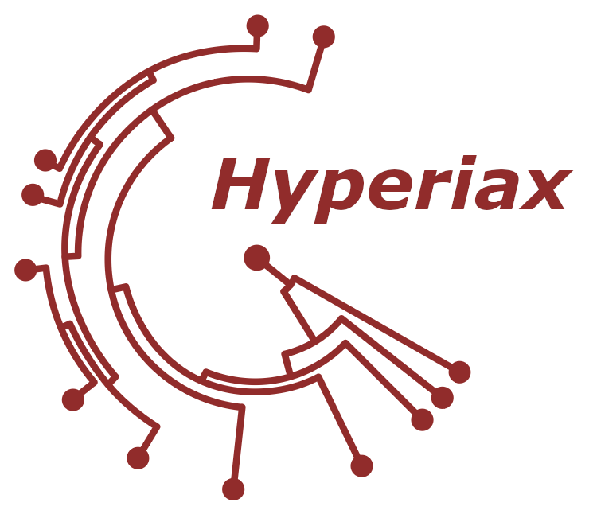

# Hyperiax: Tree traversals using JAX
<p align="center">
 
</p>

> **Note (May 2026):** the `v3` branch is a ground-up rewrite of the core API.
> The published `pip install hyperiax` still points at the legacy 0.x release.
> v3 is under active construction — see `plan-a-hyperiax-node-flax-b-purrfect-spring.md`.

## Introduction

_Hyperiax_ is a framework for tree traversal and computations on large-scale trees. Its primary purpose is to facilitate **efficient message passing** and **operation execution** on large trees. Hyperiax uses [JAX](https://jax.readthedocs.io/en/latest/index.html) for fast execution and automatic differentiation. _Hyperiax_ is currently developed and maintained by [CCEM, UCPH](https://www.ccem.dk/).

Initially, _Hyperiax_ was designed for phylogenetic analysis of biological shape data, particularly statistical inference with continuous-time stochastic processes along tree edges. Its messaging primitives are general — applicable to Gaussian graphical models, phylogenetic mean computation, recursive shape matching, and similar tree-structured problems.

## Installation (development, v3 branch)

Hyperiax v3 uses [`uv`](https://docs.astral.sh/uv/) to manage the Python environment.

```bash
# Install uv (macOS)
brew install uv

# Clone and enter the repo
git clone git@github.com:ComputationalEvolutionaryMorphometry/hyperiax.git
cd hyperiax
git switch v3

# Create the project venv and install dev dependencies (core only).
uv sync --group dev

# Or include optional extras:
#   - io:             ete3-backed Newick I/O
#   - prebuilt-shape: trimesh utilities for the LDDMM / shape prebuilts
#   - prebuilt-bffg:  diffrax-backed ODE path for the SDE BFFG filter
uv sync --group dev --extra io --extra prebuilt-shape --extra prebuilt-bffg

# Run tests
uv run pytest
```

Python 3.11 or newer is required.

## Project layout (v3)

```
hyperiax/
├── core/                 # L1 — Topology, Tree, sweep decorators (no external deps)
├── io/                   # L2 — Newick I/O via ete3
└── prebuilt/             # L2 — phylo_mean, BFFG (Gaussian/SDE), LDDMM kernels
```

## Contribution

Contributions, issues and feature requests are welcome. Please refer to the [contributing guidelines](./CONTRIBUTION.md).

## Contact

For questions related to the Hyperiax project, please contact [Stefan Sommer](mailto:sommer@di.ku.dk).
